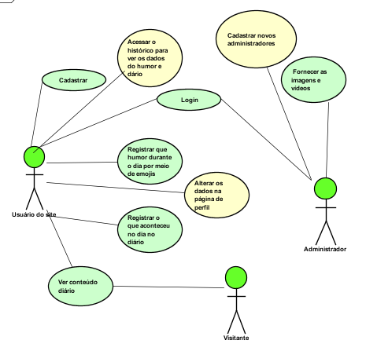

# All For One

## Projeto Final do Curso Técnico em Informática do Colégio Pedro II - Campus Duque de Caxias - 2018

## Integrantes

 - Alana Porto Nunes
 - Beatriz Melo Fernandes
 - Davi Paiva Vieira
 - Jeniffer Gomes Fonseca
 - Matheus César Mendonça Ferreira

## Súmario

- [Proposta](#proposta)
- [Casos de uso](#casos-de-uso)
- [Modelagem](#modelagem)
- [Manual](#manual)

### Proposta

#### DESCRIÇÂO

A nossa proposta é criar um Software Web com frases que proporcione motivação aos seus usuários. Nosso público alvo serão os alunos de Ensino Médio, porque percebemos que a cada dia temos mais alunos abatidos e psicológico comprometido por conta da pressão que é exercida sobre eles; mas nada impede que outras pessoas, que se sintam à vontade, também possam utilizá-lo.

- O usuário poderá fazer um cadastro para que possa usar as funções disponibilizadas pelo site;
- O visitante terá acesso apenas ao conteúdo diário.
- O site contará com conteúdo motivacional (vídeos e imagens) que será publicado diariamente;
- Poderá ter a função de diário, onde o usuário escreverá sobre como foi o seu dia e seus sentimentos;
- Cada dia será possível classificar o seu humor/sentimento de acordo com um emoji;

#### STAKEHOLDERS

- Gabriel Araújo - Professor do Colégio Pedro II  

#### LINK PARA OS REQUISITOS  

[Requisitos funcionais e não funcionais](https://github.com/cp2-dc-info-projeto-final-2018/requisitos-jambd/blob/master/REQUISITOS.md)

### Casos de uso

[Descrição Casos de Uso](https://github.com/cp2-dc-info-projeto-final-2018/requisitos-jambd/blob/master/casosdeuso.md )

### Modelagem

[Diagrama de classes](diagramadeclasses.png)
[Banco de dados](https://github.com/cp2-dc-info-projeto-final-2018/requisitos-jambd/blob/master/Codigo/Modelo/criarbanco.sql)

### Manual

Para que o usário possua uma conta, ele precisará se cadastrar.

Para que o usuário entre no site, ele precisará fazer o login ou entrar como visitante

Login:

Visitante:

Após entrar no site, ele será direcionado a pagina home, onde contara com imagens e videos

No menu fixo, contará com as opções de entrar no diário, humor e perfil

Diário:

Humor:

Perfil:

A página de perfil, contará com as opções de alterar dados do usuário e histórico de registros

Alterar dados:

Histórico:

